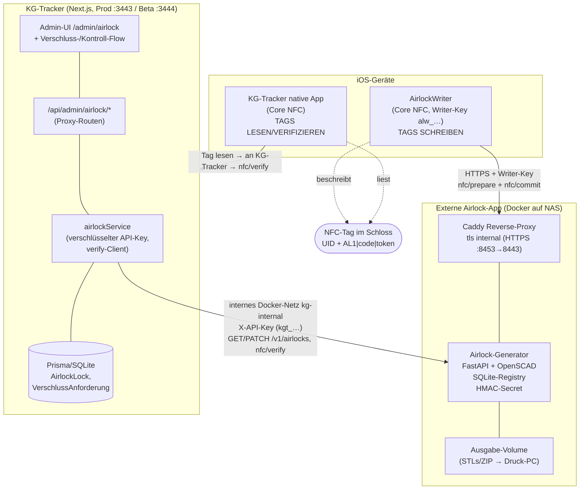

# Airlock-Feature — Architektur & Funktionsweise

**Stand:** 31.07.2026 · **Ebenen:** KG-Tracker (Consumer) ↔ Airlock3DSTLGenerator (externe „Airlock-App") · **KG-Tracker-Integration:** „Weg A" (online, ohne eigene Krypto/Registry)

---

## 1. Worum geht es — das Problem

Das Airlock-Feature soll die **Echtheit eines physischen Keuschheits-Verschlusses** nachweisbar machen. Ein „Airlock" ist ein **3D-gedrucktes Einweg-Schloss** mit einer erhabenen, 5-stelligen Nummer (wie „73412"). Ohne weitere Absicherung könnte man ein solches Schloss aber (a) mit einer erfundenen Nummer **fälschen** oder (b) die Druckdatei einfach mehrfach drucken und so **duplizieren**. Beides würde die ganze Verschluss-Logik der App aushebeln — der Sub könnte sich heimlich öffnen und mit einem Nachdruck „beweisen", er sei noch verschlossen.

Die Lösung besteht aus zwei Bausteinen:

* Die **geprägte Nummer** identifiziert das Schloss (menschenlesbar, für die visuelle Kontrolle).
* Ein in den Druck eingelegter **NFC-Tag** (NTAG213/215/216) mit ab Werk eindeutiger, unveränderlicher **UID** plus einem **kryptografisch signierten Token** macht Fälschung und Duplizierung erkennbar.

So kann die App (bzw. die KI-Keyholderin) bei einem Verschluss verlangen, dass genau *dieses* eine Schloss verwendet wird, und später per NFC-Scan verifizieren, dass es echt und unverändert ist.

---

## 2. Die drei Systeme im Zusammenspiel

Das Feature verteilt sich bewusst über **drei getrennte Codebasen**, weil sie unterschiedliche Vertrauens- und Betriebsanforderungen haben:

| System | Repo | Rolle | Enthält das Geheimnis? |
|---|---|---|---|
| **Airlock3DSTLGenerator** | `sweidinger/Airlock3DSTLGenerator` | **Producer / Source of Truth.** Erzeugt STLs, führt die Registry, verwaltet das NFC-Secret, signiert/verifiziert Tokens. | **Ja** (HMAC-Secret) |
| **KG-Tracker** | `sweidinger/chastitytracker` (Fork) | **Consumer / Frontend (Weg A).** Fragt Locks ab, wählt sie bei Verschluss aus, verifiziert online gegen den Generator. **Keine** eigene Krypto/Registry. | Nein |
| **iOS-Writer** (`AirlockWriter`) | `…/ios-writer` im Generator-Repo | **„Werkstatt"-App.** Beschreibt leere NFC-Tags per Core NFC. Nutzt einen eingeschränkten Writer-Key. | Nein (nur Writer-Key) |

Der zentrale Gestaltungsgrundsatz von **Weg A**: Das Geheimnis (das HMAC-`secret`, mit dem Tokens signiert werden) verlässt **nie** den Generator. KG-Tracker rechnet nichts selbst, sondern fragt den Generator „ist dieser Tag echt?" über REST. Dadurch bleibt der Angriffsvektor klein, und KG-Tracker bleibt ein reiner Client.



---

## 3. Die externe Airlock-App (Generator) — was sie kann

Der Generator ist ein eigenständiger **Docker-Service** (Python/FastAPI + headless OpenSCAD), der auf dem NAS läuft und **nicht öffentlich** erreichbar ist — nur im internen Docker-Netz `kg-internal` bzw. für die Tag-Beschreibung hinter einem Caddy-HTTPS-Proxy. Seine Aufgaben:

**STL-Erzeugung.** Aus einer leeren Vorlage (`DisposableLock_v2.stl`) rendert er pro Code deterministisch (gleicher Code → bytegleiche STL) ein Schloss mit erhabener, exakt platzierter Nummer. Ausgabe als ZIP über die API und zusätzlich in ein gemountetes Volume für den Druck-PC.

**Nummernvergabe & Registry.** 5-stellige Codes (`00000`–`99999`). Entweder **Auto-Vergabe** (`count: N` → der Generator zieht garantiert freie Zufallscodes) oder **Vorgabe** (`codes: [...]` → Konflikte werden gemeldet). Eine SQLite-Registry hält jeden je vergebenen Code samt Status, Batch, STL-Pfad und SHA-256. Die **finale Hoheit über Eindeutigkeit liegt bei KG-Tracker** — die Generator-Registry ist Zweitsicherung und ermöglicht Nachdruck/Reproduktion.

**Status-Lebenszyklus** eines Locks:

```
reserved ─► generated ─► printed ─► registered ─► active ─► retired
                                                     └────► voided
```

Der Generator setzt primär `reserved → generated`; die weiteren Zustände führt überwiegend KG-Tracker und spiegelt sie per `PATCH` zurück.

**REST-API (Auszug, alle `/v1`, Auth per `X-API-Key`):**

| Endpunkt | Zweck |
|---|---|
| `POST /v1/airlocks:generate` | Batch erzeugen (Auto **oder** Vorgabe) |
| `GET /v1/airlocks` · `GET /v1/airlocks/{code}` | Liste / Metadaten |
| `GET /v1/airlocks/{code}/stl` | STL herunterladen |
| `PATCH /v1/airlocks/{code}` | Status setzen (`printed`, `registered`, `retired`, …) |
| `POST /v1/airlocks/{code}/nfc/prepare` | signierten Tag-Payload liefern |
| `POST /v1/airlocks/{code}/nfc/commit` | UID endgültig an Code binden |
| `POST /v1/airlocks/{code}/nfc/verify` | Echtheit prüfen (für KG-Tracker) |
| `GET /healthz` · `/readyz` | Health-Checks |

---

## 4. Der NFC-Echtheitsschutz — das Herz des Features

**Was auf dem Tag steht** — ein NDEF-Text-Record:

```
AL1|<code>|<token>
```

* `code` — die 5-stellige Airlock-Nummer.
* `token` — `HMAC_SHA256(secret, "<code>|<UID>")`, die ersten **32 Hex-Zeichen** (128 Bit), Kleinschreibung.
* `UID` — die ab Werk eindeutige Tag-UID (Hex, Großbuchstaben, ohne Trenner).

**Warum das beide Angriffe abwehrt:**

* **Fälschung** (gültige Nummer erfinden): ausgeschlossen, weil ohne das `secret` kein gültiger Token erzeugt werden kann.
* **Duplizieren** (echte Nummer kopieren): auffällig, weil ein Nachdruck einen anderen Tag mit anderer UID hätte — der Token ist an genau *eine* UID gebunden, und in der Registry ist ein Code nur für *eine* aktive Schließung gültig.

Rest-Risiko sind „magic tags" mit änderbarer UID; dagegen greift die Registry-Einmal-Logik.

**Das Secret** wird im Generator-Dashboard verwaltet (erzeugen, verschlüsseltes Backup exportieren/wiederherstellen) und in dessen DB gespeichert; alternativ per `AIRLOCK_NFC_SECRET`-Env (Env hat Vorrang). Wichtig: Ein neues Secret entwertet alle bereits beschriebenen Tags — also einmal setzen, Backup sichern, **nicht rotieren**.

**Bindung ist endgültig.** `nfc/commit` verheiratet eine UID mit einem Code. Erneutes Schreiben desselben Tags auf denselben Code ist idempotent; ein anderer Tag auf einen belegten Code gibt **409**; ein Umzug einer UID auf einen anderen Code geht nur bewusst mit `rebind:true` (+ auf Beta zusätzlich `AIRLOCK_BETA_TAG_MOVE=1`).

**Verify-`reason`-Codes:** `unknown_code`, `bad_uid`, `bad_signature`, `uid_mismatch`, `status_retired`, `status_voided`.

---

## 5. Tags schreiben & lesen — die zwei iOS-Wege

Das **Beschreiben** der Tags braucht Core NFC (iOS) oder Web NFC (Android/Chrome über HTTPS). Weil Safari kein Web NFC kann, gibt es zwei getrennte native Rollen:

* **AirlockWriter (Werkstatt-App):** schlanke native iOS-App, die nur Tags beschreibt. Ablauf in einem Antippen: UID lesen → `nfc/prepare` (Payload vom Server holen) → NDEF-Text schreiben → `nfc/commit` (UID binden). Sie nutzt einen **Writer-Key** (`alw_…`) — der darf Locks *lesen* und Tags *beschreiben*, aber **nicht** generieren, herunterladen, Status wechseln oder verifizieren. Ein Key pro Gerät, einzeln widerrufbar, liegt im iOS-Keychain. So wandert nie der volle API-Key aufs Gerät.
* **KG-Tracker native App:** übernimmt im Alltag das **Lesen/Verifizieren** — Tag scannen, `AL1|code|token` + UID an KG-Tracker geben, das gegen `nfc/verify` prüft.

(Fürs LAN akzeptiert der Writer aktuell Caddys selbstsigniertes Zertifikat über einen `InsecureTrust`-Delegate; für Dauerbetrieb soll stattdessen die Caddy-Root-CA aufs iPhone.)

---

## 6. Die KG-Tracker-Seite (Consumer, Weg A) — Funktionen

KG-Tracker persistiert die zurückgemeldeten Codes als **Airlock-Datensätze** (`AirlockLock`, u. a. `assignedUserId`, `nfc_uid`, Status) und ist damit die App-seitige Source-of-Truth für Zuweisung und Nutzung. Der `airlockService` hält den **verschlüsselten** API-Key und spricht den Generator über Proxy-Routen unter `/api/admin/airlock/*` an. Bedienung über `/admin/airlock` (globaler Menüpunkt + Sub-Tab). Die zuletzt gebaute **Multi-Lock**-Logik:

**Pool statt 1:1.** Ein Sub kann mehrere Locks zugewiesen haben (`getAssignedLocks()` als Liste). `assignLock` gibt nicht mehr automatisch das alte frei; Freigabe erfolgt einzeln im Zuweisungs-Tab.

**Vorgabe durch die Anforderin.** Die `VerschlussAnforderung` hat ein Feld `airlockCode`. Im Anfordern-Dialog gibt es ein Dropdown „Airlock-Lock vorgeben" (self-fetch via `GET /api/admin/airlock/assigned?userId=`). Regeln:
* Mit Vorgabe **muss** der Sub genau dieses Lock scannen (Pflicht).
* Ohne Vorgabe wählt der Sub aus seinem Pool — der **Scan entscheidet**, welches Lock aktiv wird.
* Ohne Zuweisung ist der Tag optional.

**Freeze des aktiven Locks.** `getActiveAirlockCode(userId)` ermittelt aus dem jüngsten VERSCHLUSS/OEFFNEN das aktive Lock. Ein aktives Lock ist **nicht freigebbar/änderbar** → `releaseLock` wirft `AIRLOCK_LOCK_ACTIVE`.

**Kontrolle.** Bei einer Kontroll-Aufgabe wird die am Device gebundene `Entry.airlockUid` gegen die registrierte UID/den Token geprüft (online via `nfc/verify`).

**Ablegen tötet das Lock (Einweg-Prinzip).** Beim endgültigen OEFFNEN eines Airlock-Verschlusses ruft KG-Tracker post-Transaktion `retireLock(code)` → setzt den Generator-Status auf `retired` (das darf schon der KG-Key, ohne Generator-Umbau) und markiert es lokal `retired`, Zuweisung wird gelöst. Ist der Server gerade nicht erreichbar, bleibt `AirlockLock.retireRequestedAt` gesetzt; ein späterer `syncAndListLocks` zieht das nach und schützt gegen ein Status-Downgrade `retired → active`.

**Kein temporäres Öffnen.** Weil ein Airlock ein Einweg-Schloss ist, ist eine Reinigungs-/Toiletten-PAUSE (PAUSE_BEGIN CAGE) bei aktivem Airlock-Verschluss gesperrt → `AIRLOCK_NO_TEMP_OPEN`. Nur das endgültige Ablegen ist erlaubt.

**Fehlercodes** (jeweils mit de/en-Keys): `AIRLOCK_VERSCHLUSS_REQUIRES_TAG`, `AIRLOCK_NO_TEMP_OPEN` (entryErrors.ts), `AIRLOCK_LOCK_ACTIVE`, `AIRLOCK_LOCK_NOT_ASSIGNED` (serviceErrorCodes.ts).

### 6a. Verifizierte Code-Struktur (`src/lib/airlock/`)

Der Consumer-Teil ist sauber in fünf Module getrennt (bestätigt am lokalen Stand):

| Modul | Aufgabe |
|---|---|
| `uid.ts` | `canonicalUid()` (UID → Großbuchstaben-Hex), `normalizeUid()`, `parseNdef()` (`AL1\|code\|token` zerlegen) |
| `config.ts` | `AirlockConfig` lesen/schreiben (`getAirlockConfigSafe`, `saveAirlockConfig`), `resolveAirlockAccess()` (entschlüsselter Key nur serverseitig), `airlockEnabled()` |
| `client.ts` | **reiner REST-Client** zur Airlock-API: `testConnection`, `listLocks`, `listAvailableLocks`, `getLock`, `setStatus`, `verify` |
| `service.ts` | **DB-Orchestrierung**: `syncAndListLocks`, `assignLock`, `releaseLock`, `getAssignedLocks`, `getActiveAirlockCode`, `retireLock`, `activateAirlockLock` |
| `verify.ts` | **Nachweis-Logik** der Flows: `verifyProof`, `verifyForVerschluss`, `verifyForKontrolle` |

**Datenmodelle** (Prisma): `AirlockConfig` (`baseUrl` + `apiKeyEnc`, verschlüsselt, nie ins Frontend), `AirlockLock` (Spiegel: `code`, `nfcUid`, `status`, `assignedUserId`, `lastSyncedAt`, `retireRequestedAt`), sowie die Felder `VerschlussAnforderung.airlockCode` und `Entry.airlockCode` / `Entry.airlockUid`.

**API-Routen:** `/api/admin/airlock/{config,test,locks,assign,assigned}` (Admin-Proxy) und `/api/airlock/verify` (Scan-Nachweis). UI-Bausteine: `AirlockAdminClient.tsx`, `AirlockAssignmentForm.tsx`, `AirlockScanField.tsx`.

**Wichtiges Sicherheitsdetail:** Die **UID kommt IMMER aus der Hardware-Identifikation**, nie aus dem NDEF-Inhalt — sonst könnte ein manipulierter Text-Record eine fremde UID vortäuschen. `verifyProof` kanonisiert die Hardware-UID und ruft `POST /v1/airlocks/{code}/nfc/verify`; die Signaturprüfung bleibt komplett beim Generator (Weg A).

**Zusätzliche Kopierschutz-Regel:** Ist ein Tag echt (`valid:true`), aber nie committed (`bound_uid == null`), wird er **abgelehnt** (`AIRLOCK_TAG_NOT_REGISTERED`) — ein echter, aber unregistrierter Tag zählt nicht.

**Verify-Fehlercodes der KG-Tracker-Schicht:** `AIRLOCK_NOT_REACHABLE`, `AIRLOCK_TAG_INVALID`, `AIRLOCK_TAG_UID_MISMATCH`, `AIRLOCK_TAG_NOT_REGISTERED`, `AIRLOCK_TAG_RETIRED`, `AIRLOCK_WRONG_LOCK` (letzterer bei fremdem Lock, verfehlter Vorgabe oder Pool-Fremdheit).

---

## 7. End-to-End-Ablauf (ein Schloss von der Wiege bis zur Bahre)

1. **Erzeugen:** KI-Keyholderin/Admin ruft `POST /v1/airlocks:generate` → Generator zieht freie Codes, rendert STLs, Status `generated`, ZIP + Volume.
2. **Import:** KG-Tracker übernimmt Codes als `AirlockLock`-Datensätze (Source-of-Truth), Status `registered`.
3. **Drucken:** STL wird gedruckt (mit eingelegtem NFC-Tag-Inlay), optional `PATCH → printed`.
4. **Tag beschreiben:** AirlockWriter liest die Tag-UID, holt via `nfc/prepare` den signierten Payload, schreibt `AL1|code|token`, bindet per `nfc/commit` die UID endgültig an den Code.
5. **Zuweisen:** Admin weist dem Sub eines/mehrere Locks zu (Pool).
6. **Verschluss:** Anforderin stellt eine `VerschlussAnforderung`, optional mit `airlockCode`-Vorgabe. Der Sub scannt beim Verschließen den Tag → das Lock wird `active`, `Entry.airlockUid` wird gebunden.
7. **Kontrolle:** Bei Kontroll-Aufgaben scannt der Sub → KG-Tracker prüft online gegen `nfc/verify` (UID + Token + Status).
8. **Ablegen:** Endgültiges OEFFNEN → `retireLock` → Status `retired`, Zuweisung gelöst, Lock verbraucht. Kein Temp-Open zwischendurch.

---

## 8. Verbindung KG-Tracker ↔ externe App (Netz, Auth, TLS)

**Aufrufrichtung:** immer KG-Tracker → Generator (synchron, REST). Der Generator ruft KG-Tracker nicht aktiv auf (optionaler Webhook `on_batch_complete` ist Zukunft).

**Netz & Auth:** Beide Container im internen Docker-Netz; Zugriff über Servicenamen `airlock-generator:8000`, gemeinsames Shared-Secret als `X-API-Key`. Drei getrennte Key-Klassen mit unterschiedlichen Rechten:
* **Voller API-Key** — alles (Dashboard/Admin).
* **KG-Tracker-Key** (`kgt_…`) — lesen/verifizieren/Status, aber **kein** Schreiben von Tags.
* **Writer-Key** (`alw_…`) — nur `nfc/prepare` + `nfc/commit`, sonst nichts.

**TLS-Besonderheit (dokumentierter Fix):** Der Generator läuft hinter Caddy mit selbstsigniertem Internal-Cert (`airlock-generator-caddy-1`, `:8453→8443`). Node-`fetch` in KG-Tracker lehnte das ab. Lösung ohne Code: Caddy-Root-CA (`/data/caddy/pki/authorities/local/root.crt`) in den KG-Tracker-Container nach `/app/data/airlock-ca.crt` legen und `NODE_EXTRA_CA_CERTS` in `.env` setzen. Weil `/app/data` ein persistentes Volume ist und `build-*.sh` die `.env` sichert/restauriert, überlebt das Container-Recreates. Das iPhone vertraut der NAS-nginx-CA separat.

**Aktueller Deploy-Stand:** Basis + Multi-Lock sind auf **Beta** (`:3444`) deployt und die Backend-Kette ist live verifiziert (Verbindungstest zeigt 4 Locks). Prod-Deploy steht noch aus.

**Achtung Versionskontrolle:** In diesem Arbeitskopie-Stand ist der gesamte Airlock-Code (inkl. `docs/AIRLOCK_NFC*.md`, `src/lib/airlock/`, beide Migrationen `20260730120000_airlock` + `20260731000000_airlock_multi_lock`) noch **untracked** — `git`-HEAD steht auf `6538c3f` (Schicksalsrad v4.132.0), und auf GitHub ist der Airlock-Zweig gar nicht vorhanden. Das Feature lebt also lokal/auf der NAS-Beta, aber ist noch nicht committet/gepusht.

---

## 9. Sicherheitsmodell (zusammengefasst)

* **Geheimnis-Isolation:** Das HMAC-`secret` liegt ausschließlich im Generator; KG-Tracker verifiziert nur remote (Weg A). Kompromittierung eines KG-Tracker-Hosts gibt keine Signierfähigkeit.
* **Least Privilege bei Keys:** getrennte Key-Klassen (`kgt_…` kann nicht schreiben, `alw_…` kann nicht generieren/verifizieren), einzeln widerrufbar, auf iOS im Keychain.
* **Einmaligkeit:** UID↔Code-Bindung endgültig; Code nur für eine aktive Schließung gültig; Einweg-Retire beim Ablegen; kein Temp-Open.
* **Determinismus/Audit:** bytegleiche STLs mit SHA-256 in der Registry; Audit-Log der Generierungen und Statuswechsel.
* **Netzgrenze:** Generator nicht öffentlich, nur internes Docker-Netz + API-Key; Web NFC nur über HTTPS-Proxy.

---

## 10. Offene Punkte

* **MCP/PATCH-Edit-Pfad:** Die KI-Keyholderin soll `airlockCode` programmatisch setzen und eine bestehende Vorgabe nachträglich ändern können (`mcpWrite.ts` + `updateLockRequest`). Aktuell ist die Vorgabe nur beim Erstellen der Anforderung setzbar.
* **On-Device-NFC-Test:** braucht ein Lock mit committetem Tag (die 4 Test-Locks sind nur `generated`, ohne UID) — Tag muss generator-seitig geschrieben werden.
* **Prod-Deploy** des Multi-Lock-Standes (inkl. CA-Fix in `prod-src/.env`).
* **Native iOS-Verifikation & Push:** TestFlight-Build mit Push-Fix, App-Icon, APNs-Key/Server-ENV für die Push-Zustellung.
* **Anti-Counterfeit-Ausbaustufe (optional):** Prüfziffer, QR/DataMatrix oder stärkere Signatur — im Generator als Feature-Flags vorgesehen.
